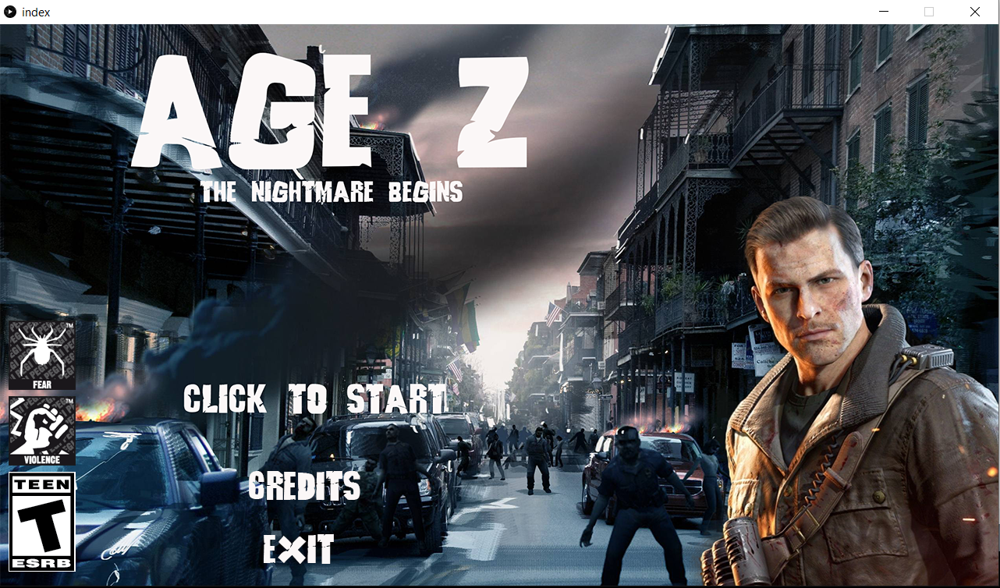
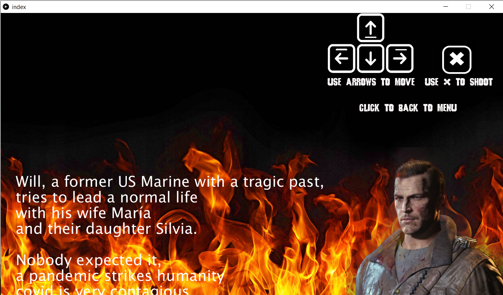
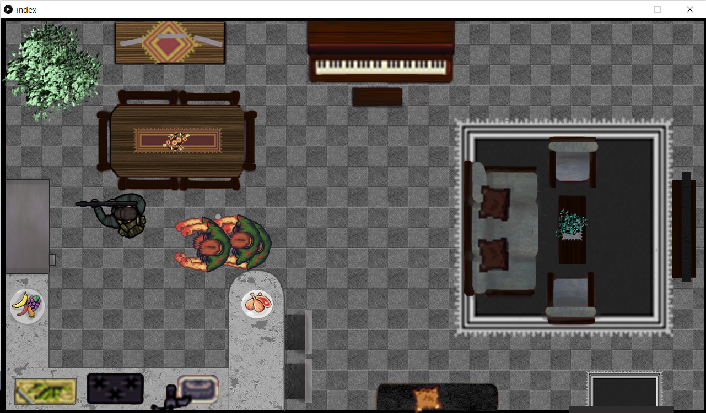
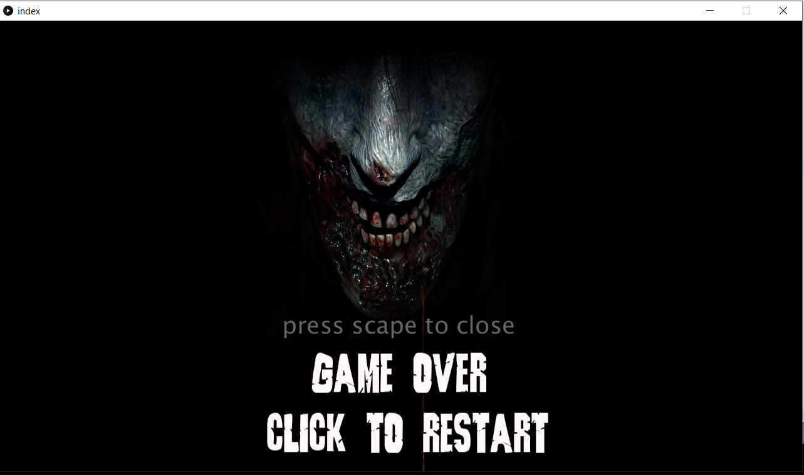

AGE Z
================

`AGE Z` es un juego `TOP AND DOWN` de supervivencia.

### Resumen

Encarna a Will un hombre destrozado por lo que ha traido la pandemia. La cosa empeora cuando una mañana se da cuenta
de que su familia no está, se oyen ruidos en la casa. Algo no anda bien...

### Características

-Es un juego tipo "top an down" cuyo fin es entretener.

-El objetivo del juego es matar a todos los zombies para que will pueda salvar a su familia.

-Will se controla con  `las flechas del teclado` y dispara con la tecla  `x`.

- Al más minimo contacto con un zombie Will morira, por eso will no debe estar cerca de los zombies.

-El arma de will tiene cierto alcance, el zombie no puede estar fuera de la reticula del arma ya que el disparo no afectara.

-El mapa tiene ciertas zonas por donde will no podra caminar, pero los zombies si podran hacerlo lo que hara un poco mas dificil  el juego.

Autores
----

- Jhonathan Alexsander Murcia Galan 2191653 
- Andres Felipe Araque Guerrero 2190443 

**Estudiantes de Ingeniería Electrónica - Programación 1 GRUPO D2**
